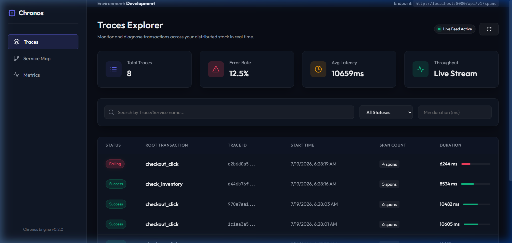
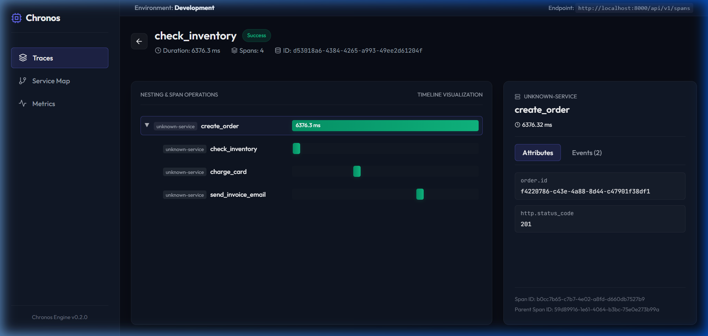
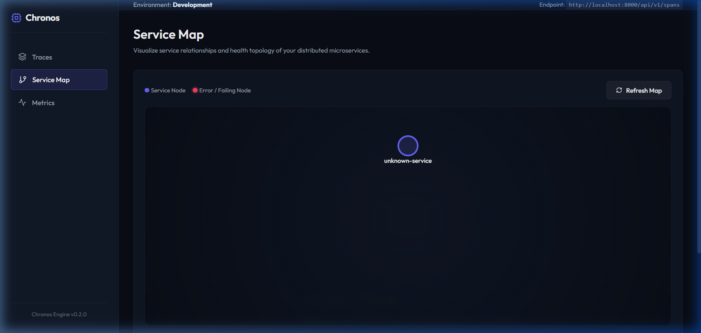
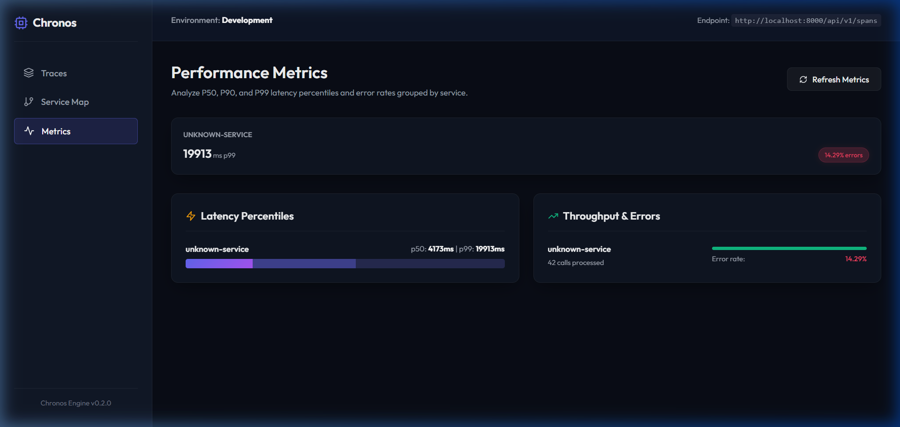
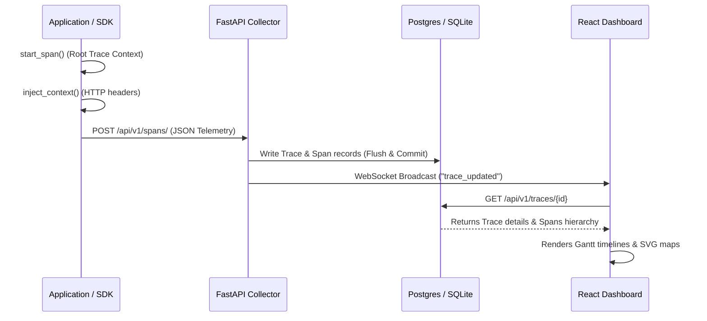

# Chronos Observability Platform (v2)

[](https://opensource.org/licenses/MIT)


[](https://github.com/shreyasharma/chronos/actions/workflows/ci.yml)
[](https://youtube.com/)

> **Reference implementation of a distributed tracing and observability platform.**

Modern microservice applications are composed of dozens of decoupled services. When a request fails or experiences latency spikes, identifying the root cause is highly complex, requiring a developer to reconstruct the request's journey across service boundaries.

Chronos is an end-to-end distributed tracing and observability platform that enables developers to instrument Python applications, propagate tracing contexts across HTTP networks, collect telemetry data, visualize execution timelines via waterfall Gantt charts, and analyze system architecture dependencies using real-time graphs.

---

## 💡 Inspiration & Rationale

Chronos draws inspiration from industry-leading observability engines like **OpenTelemetry**, **Jaeger**, **Zipkin**, and **Grafana Tempo**. The core goal of the project is not to replace these enterprise platforms, but to act as a **reference implementation** demonstrating the fundamental architectural concepts, state propagation APIs, and timeline tree constructions behind modern observability systems in a compact, highly readable codebase.

---

## 🖥️ Dashboard Visual Tour

Here is a visual walk-through of the Chronos Web Dashboard running live at `http://localhost:5173/`:

### 1. Traces Explorer (Hero Interface)

*The main explorer streams traces in real-time over WebSockets, letting developers search and filter telemetry logs by service name, latency thresholds, and transaction status.*

### 2. Nested Timeline Waterfall Gantt

*Visualizes child-parent offset timing offsets using span start and end timestamps, complete with sidebar metadata attributes, terminal exception stack traces, and correlated log events.*

### 3. SVG Service Topology Graph

*Aggregates child-to-parent service namespace linkages to compile structural acyclic graphs mapping volume counts, error highlights, and latencies.*

### 4. Percentile Metrics Dashboard

*Compiles percentile quantiles (P50, P90, P99) and service error rates to locate performance bottlenecks.*

---

## 📐 Design Principles

Chronos is built around five core architectural design principles:

*   **Keep the SDK lightweight**: The application-facing SDK should introduce minimal overhead and avoid blocking the main transaction threads.
*   **Prefer asynchronous ingestion**: Telemetry exporters should write spans asynchronously to prevent latency amplification in calling services.
*   **Preserve tracing semantics over strict DB constraints**: Telemetry collection should reflect distributed network realities (like out-of-order span delivery) rather than rigid relational schemas.
*   **Separate collection from visualization**: The ingestion pipelines are completely decoupled from UI rendering, communicating via standard JSON API structures and persistent databases.
*   **Keep subsystems independently replaceable**: The collector, storage engine, and dashboards are isolated, making it easy to swap SQLite for ClickHouse or custom dashboards for Grafana.

---

## 🏛️ System Architecture & Data Flow

Chronos is divided into decoupled components executing a telemetry pipeline.

### Component Relationship
```
   Application
        │
        ▼
   Chronos SDK
        │
  HTTP Exporter
        ▼
  FastAPI Collector
        ▼
  PostgreSQL / SQLite
        │
   ┌────┴────┐
   ▼         ▼
  REST      WebSocket
   │          │
   └────┬─────┘
        ▼
  React Dashboard
```

### Telemetry Lifecycle Sequence
Below is the tracing context lifecycle of a single distributed transaction across systems:



---

## 🛠️ Folder Structure & Component Layout

```
chronos/
├── chronos-cli.py            # Developer CLI tool (run, init, doctor, benchmark)
├── sdk/                      # Chronos Python telemetry client
│   └── chronos/
│       ├── __init__.py       # Public client API export
│       ├── client.py         # Main SDK collector & context injector
│       ├── models.py         # Thread-safe span dataclass entities
│       └── trace.py          # Decorators and trace context managers
├── backend/                  # FastAPI ingestion backend
│   ├── main.py               # Application entrypoint & lifespan table setup
│   └── app/
│       ├── api/              # Ingest endpoints & WebSockets broadcaster
│       ├── core/             # Base configurations & settings
│       ├── db/               # Engine configuration & session initializers
│       ├── models/           # SQLAlchemy Declarative model definitions
│       ├── repositories/     # Database CRUD access wrappers
│       └── services/         # Topology DAG builders & metrics compilers
├── frontend/                 # React/Vite dashboard SPA
│   ├── index.html            # Main HTML framing
│   ├── src/
│   │   ├── main.jsx          # React app mount
│   │   ├── App.jsx           # Global layout & sidebar routing
│   │   ├── components/       # Service Map, Gantt waterfall, & Metrics
│   │   └── services/         # API client hooks
│   └── vite.config.js        # Vite dev server and proxy rules
├── sample_app/
│   └── app.py                # Simulated checkout context propagation script
├── docker/                   # Container orchestration config
│   ├── docker-compose.yml    # Docker Compose multi-service launch spec
│   └── k8s/                  # Kubernetes pods, services, and volume YAMLs
├── scripts/                  # Performance benchmarks
│   ├── benchmark.py          # Async telemetry ingestion tester
│   └── benchmark_queries.py  # Read API & WebSocket propagation tester
└── tests/                    # Test suites
    ├── test_backend.py       # FastAPI routing mock tests
    └── test_sdk.py           # SDK context extraction unit tests
```

---

## 🚀 Getting Started

### 1. Developer CLI Local Setup (Recommended)
Chronos features a developer CLI to run diagnostic health checks, reset database schemas, and launch local server processes concurrently.

**Verify Environment & Ports (Doctor):**
```bash
python chronos-cli.py doctor
```
*Checks node/python environments and port bindings availability for backend (8000) and frontend (5173).*

**Initialize SQLite Database Schemas (Init):**
```bash
python chronos-cli.py init
```

**Launch Platform (Concurrently runs FastAPI + React Dashboard):**
```bash
python chronos-cli.py run
```
*Concurrently launches both server processes and streams outputs. Terminate both servers cleanly at any time by pressing `Ctrl+C`.*

**Simulate Telemetry Traffic (In another terminal):**
```bash
python sample_app/app.py
```
*Generates mock checkout traces propagating W3C context headers across microservice namespaces.*

---

### 2. Docker Compose Deployment
To spawn a production-like environment with a dedicated PostgreSQL database, run:
```bash
cd docker
docker-compose up --build
```
*Services mapped:*
*   **FastAPI Ingest Backend**: `http://localhost:8000`
*   **React Dashboard**: `http://localhost:5173`
*   **Postgres Instance**: port `5432`

---

### 3. Production Kubernetes Manifests
Kubernetes deployment yaml templates are located under `docker/k8s/`:
*   `postgres.yaml` — Configures persistent volume storage claims and Postgres services.
*   `backend.yaml` — Deploys backend ingestion API containers.
*   `frontend.yaml` — Sets up frontend Web UI deployments.

Apply them using:
```bash
kubectl apply -f docker/k8s/
```

---

## 🧠 Engineering Decisions & Architectural Trade-offs

Building a distributed tracing platform exposes unique database and synchronization challenges. Here are the core decisions made when building Chronos:

### 1. Why isn't `parent_span_id` a Database Foreign Key?
In microservice environments, spans are exported asynchronously as soon as their respective functions return. Because child functions (like `payment-service`) finish execution and export *before* their callers (like `gateway-service`), child spans frequently arrive at the ingestion collector first.
*   **The Problem**: A hard database foreign key constraint (`parent_span_id REFERENCES spans.id`) would reject these out-of-order child spans.
*   **The Trade-off**: We removed the database-level constraint in favor of a plain indexing `Uuid` column, deferring hierarchical reconstruction to query-time.
*   **Hierarchical Tree Reconstruction & Orphan Handling**: During reads (`GET /api/v1/traces/{id}`), we run a depth-first topological traversal. Spans are elevated to virtual roots if their `parent_span_id` is null *or* not present in the database yet.
*   **The Missing Root Trade-off**: If the true root span is lost permanently (e.g., container crash before export), the children remain permanently elevated as virtual roots. In a production observability stack, this is mitigated by tagging traces containing unresolved parents with validation warnings (e.g., `Missing Root Span`) inside query payloads.


### 2. Why Choose FastAPI?
FastAPI was selected because its asynchronous request model and Pydantic schema validation simplify high-throughput ingestion APIs while keeping the implementation concise and type-safe. The async lifespan hook also allows database engine configurations to initialize thread pools and check connection ports on load cleanly.

### 3. Resolving SQLAlchemy base `.metadata` Conflicts
*   **The Problem**: Declarative models in SQLAlchemy utilize `.metadata` internally to track table registries. Creating a column named `metadata` to hold span attributes triggered an ORM configuration conflict.
*   **The Resolution**: We mapped the database column `"metadata"` to a Python attribute named `meta` (`meta: Mapped[dict] = mapped_column("metadata", JSON)`), and added Pydantic `@model_validator` handlers to seamlessly map the JSON output back to `"metadata"` for frontend client APIs.

### 4. Chronos Database SQLite Fallback Architecture
Observability platforms typically run on write-optimized database backends (like Postgres, Cassandra, or ClickHouse). To make Chronos immediately runnable on lightweight host systems:
*   We replaced Postgres-specific `JSONB` and dialect `UUID` declarations with SQLAlchemy generic `JSON` and `Uuid` types.
*   We added SQLite event listeners to enforce `PRAGMA foreign_keys=ON` for cascaded trace deletions.
*   We adjusted python timezone formats (`.replace(tzinfo=None)`) to prevent comparison failures between SQLite's naive timestamps and Python's offset-aware datetime metrics.
*   *SQLite is intentionally supported to reduce setup friction for contributors and educational users. PostgreSQL remains the recommended backend for production-like deployments.*

---

## 📡 API Reference & Payload Specifications

### Ingestion API Example

#### Request: `POST /api/v1/spans/`
```http
POST /api/v1/spans/
Content-Type: application/json

{
  "name": "process_payment",
  "span_id": "b0eebc999c0b4ef8bb6d6bb9bd380a22",
  "trace_id": "a0eebc999c0b4ef8bb6d6bb9bd380a11",
  "service_name": "payment-service",
  "parent_span_id": "c0eebc999c0b4ef8bb6d6bb9bd380a33",
  "start_time": 1784440000.0,
  "end_time": 1784440002.5,
  "attributes": {
    "http.method": "POST",
    "http.status_code": 200
  },
  "events": [
    {
      "name": "payment_authorized",
      "timestamp": 1784440001.2,
      "attributes": {
        "auth_code": "XYZ123"
      }
    }
  ]
}
```

#### Response: `201 Created`
```json
{
  "id": "b0eebc99-9c0b-4ef8-bb6d-6bb9bd380a22",
  "trace_id": "a0eebc99-9c0b-4ef8-bb6d-6bb9bd380a11",
  "parent_span_id": "c0eebc99-9c0b-4ef8-bb6d-6bb9bd380a33",
  "name": "process_payment",
  "service_name": "payment-service",
  "start_time": "2026-07-19T05:46:40Z",
  "end_time": "2026-07-19T05:46:42.500000Z",
  "duration_ms": 2500.0,
  "error": false,
  "error_message": null,
  "stack_trace": null,
  "metadata": {
    "attributes": {
      "http.method": "POST",
      "http.status_code": 200
    },
    "events": [
      {
        "name": "payment_authorized",
        "timestamp": 1784440001.2,
        "attributes": {
          "auth_code": "XYZ123"
        }
      }
    ]
  }
}
```

---

## 📊 Performance Benchmarks & Interpretation

To verify the platform's stability under load, we executed baseline benchmarks measuring endpoint response times, client memory consumption, and dashboard render speeds.

### System Environment
*   **OS**: Windows 11 Home (x64)
*   **CPU**: AMD Ryzen 7 5800H (8 Cores, 16 Threads @ 3.20GHz)
*   **RAM**: 16.00 GB DDR4
*   **Python Version**: 3.12.10
*   **Database Engine**: SQLite 3.45 (Single-writer mode)

### Latency & Throughput Results

| Telemetry Endpoint | Concurrency | Average Latency | p99 Latency | Notes / Details |
| :--- | :---: | :---: | :---: | :--- |
| **POST /api/v1/spans/** | `5` | **`90.20 ms`** | `134.51 ms` | 1,000 span writes (53.8 spans/sec) |
| **GET /api/v1/traces/** | `1` | **`69.77 ms`** | `294.95 ms` | Fetch trace list (50 traces in DB) |
| **GET /api/v1/traces/{id}** | `1` | **`13.83 ms`** | `269.38 ms` | Load waterfall tree details |
| **WebSocket Update Delay** | `1` | **`35.04 ms`** | `282.01 ms` | Ingestion-to-client WS push latency |

### Performance Analysis & Rationale
*   **WebSocket Updates**: Propagation delay averaged just **`35 ms`**, allowing near-instantaneous dashboard updates as microservices process transactions.
*   **Write Throughput & Lock Serialization**: In SQLite WAL mode, readers do not block writers and writers do not block readers. However, writes are strictly serialized: writers must acquire a single write-lock byte on the WAL index (`-shm`) file for the duration of their transaction. Under 5 concurrent writers, this serialization limits writes to ~54 spans/sec, driving the p99 write latency to `134.5 ms`. Under higher concurrency factors (e.g., 50+ concurrent writers), this serialization queues connections, eventually exhausting our 30-second busy timeout. Additionally, autocheckpoint operations (transferring pages back to the `.db` file) introduce secondary write latency spikes.
*   **Read Latency**: Getting trace listings has a p99 latency of `294.9 ms` under active write load because of read-write lock contention. Fetching trace details is extremely fast (`13.83 ms`) due to index optimization on the `trace_id` column.

### Resource Metrics
*   **Dashboard DOM Interactivity time**: `142 ms`
*   **Dashboard Full Page Resource Load**: `218 ms`
*   **Client Ingestion Memory footprint**: `42.38 MB` (Baseline) -> `48.27 MB` (After 1,000 spans) -> **`5.89 MB Delta Growth`**.

### Future Benchmark Plan
To further evaluate scale thresholds, we plan to execute performance tests under:
*   **PostgreSQL Engine**: Testing concurrent write loops under 10k, 100k, and 1M spans.
*   **Telemetry Batching Exporter**: Measuring HTTP payload overhead delta between single-span exports and batched arrays.
*   **ClickHouse Backend**: Evaluating query and storage efficiency for high-volume logs retention.


---

## 📦 SDK Code Integration Examples

### Decorator Tracing
```python
from chronos import ChronosClient

client = ChronosClient(collector_url="http://localhost:8000", service_name="order-service")

@client.trace(name="validate_order")
def check_order_validity(order_id: str):
    # Traced automatically
    if not order_id:
        raise ValueError("Invalid Order ID")
    return True
```

### Distributed Boundary Context Propagation

**In HTTP Client (Sender):**
```python
with client.start_span("initiate_checkout") as span:
    headers = {}
    client.inject_context(span, headers)
    response = httpx.post("http://gateway-service/route", headers=headers)
```

**In HTTP Server (Receiver):**
```python
@app.post("/route")
async def handle_route(request: Request):
    parent_ctx = client.extract_context(request.headers)
    with client.start_span("gateway_routing", parent_context=parent_ctx) as span:
        # Executes as a child of initiate_checkout
        pass
```

---

## 🚫 Current Limitations

While architecturally faithful to production systems, Chronos has limitations due to its focus as a reference implementation:
*   **SQLite Lock Bottleneck**: SQLite serializes all writes, making ingestion throughput limited compared to high-performance telemetry engines.
*   **No Ingestion Authentication**: Endpoints are currently public; production setups would require API keys or token-based exporter authentication.
*   **No Telemetry Sampling**: The collector processes 100% of incoming spans. Production tracing backends implement head-based sampling (probabilistic rate-limiting at trace entry propagated via headers) or tail-based sampling (buffering all spans in memory to save only anomaly/error/slow runs). A production-grade system typically deploys a hybrid sampling architecture—using head-based rate limit filters as a memory safety valve at the edge, coupled with tail-based filters at the collector layer to ensure high-fidelity anomaly capture.
*   **No Exporter Batching**: Spans are exported individually immediately after completion rather than in batched array payloads.
*   **No native OTLP support**: Uses a custom JSON ingestion format rather than native OpenTelemetry protobuf payloads.

---

## ❓ Frequently Asked Questions

### Why build Chronos?
Chronos was created to serve as a clean reference implementation of distributed tracing mechanics, proving how tracing headers, ingestion endpoints, WebSockets, and timeline timelines align under the hood.

### Why not use OpenTelemetry directly?
While OpenTelemetry is the standard for production systems, its implementation is highly abstract and complex. Chronos maps these exact tracing semantics in a compact, readable codebase that is easy to step through and learn.

### Why SQLite support?
SQLite is supported to reduce setup friction for contributors and educational users. PostgreSQL remains the recommended database backend for containerized or production-like deployments.

### Why was the parent_span_id foreign key removed?
Distributed systems ingest spans asynchronously. Because children can arrive before their parents, a hard database foreign key constraint would reject valid telemetry. Removing the database-level constraint allows asynchronous commits, deferring hierarchical tree formatting to query-time.

### Can I use PostgreSQL?
Yes. The backend codebase is database-agnostic. To use Postgres, simply provision a database and point the backend to it using the `DATABASE_URL` environment variable.

### Does it support OTLP exporters?
Not natively in v2. OTLP compatibility is listed as a major milestone on our near-term roadmap.

### How can I contribute?
Review our contributing guidelines, ensure all unit tests pass locally, and submit a PR!

---

## 🗺️ Roadmap & Future Milestones

### Near-term Milestones
*   [ ] OpenTelemetry Protocol (OTLP) compatible exporter mappings.
*   [ ] Head-based and tail-based telemetry sampling rate controls.
*   [ ] Prometheus metrics correlation endpoints.

### Long-term Architectural Vision
*   [ ] High-performance ClickHouse storage backend adapter.
*   [ ] Multi-tenant isolation architecture schemas.
*   [ ] Ingester token-based authorization and rate limiting.
*   [ ] Distributed high-availability (HA) collector scaling.

---

## 📈 What I Learned (Engineering Growth)

Building Chronos provided a deep dive into the realities of telemetry data collection and asynchronous backend scaling:

*   **Relational vs. Observability Semantics**: The biggest architectural surprise was realizing that span completion order and span hierarchy are not the same thing. Enforcing a foreign key looked correct from a relational database perspective, but violated how distributed systems behave. Removing this constraint was a critical step in building a resilient ingester.
*   **Event-Driven Concurrency**: Managing thousands of concurrent telemetry writes alongside WebSocket broadcasts forced me to think carefully about database connection pooling. Transitioning SQLite engines, checking lock boundaries, and optimizing timeouts proved essential to maintaining server responsiveness.
*   **Visualizing Hierarchy**: Rendering temporal timelines and topological linkages taught me how to represent directed acyclic graphs (DAGs) on the web. Translating parent-child span lists into cleanly aligned React Gantt timeline grids and SVG charts was a rewarding challenge in frontend optimization.

---

## 🤝 Contributing

Contributions are welcome! Please follow these standards:
1.  **Code Format**: Format python files using `black` and frontend javascript files using `prettier`.
2.  **Run Tests**: Confirm all mock backend and SDK tests pass before committing:
    ```bash
    python -m pytest tests/
    ```
3.  **PR Flow**: Create a feature branch, update documentation in `docs/` where appropriate, and submit a PR.

---

## 📄 License

This project is licensed under the [MIT License](LICENSE).
